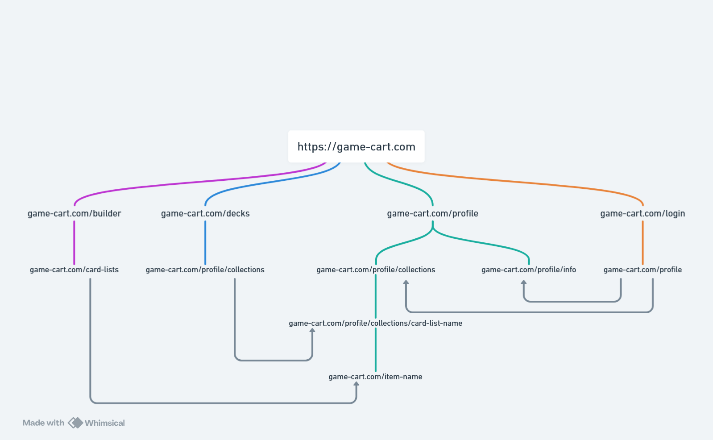

# TGC-art atelier 2026

# Le projet

- Le site regroupe des collections de carte de plusieurs jeux differents (ex : yu-gi-oh, pokemon, magic, etc).
  L'utilisateur poura crée une collection de carte a travers differents jeux basé uniquement sur les qualités artistique et viuel.

## Target user

- Ce site d'addresse aux collectioneur de carte interessé non par la rareté de la carte mais surtout sur leurs qualités visuel et thème en commun
  a traver different jeux.
- L'utilisateur cible peux etre de tout age ou avoir n'importe quelle profession mais est passioné par un des mondes des jeux inclus ou un fan d'art en tout genre.

## Exemple de personas

- Léa M.
  - Âge : 24 ans
  - Profession : Étudiante en design graphique
  - Objectif : Créer des collections thématiques par esthétique et les partager sur ses réseaux
  - Situation : Collectionneuse Pokémon depuis l'adolescence, attirée par d'autres jeux uniquement pour leurs visuels. Budget limité, préfère les galeries numériques aux cartes physiques.

- Thomas R.
  - Âge : 38 ans
  - Profession : Développeur web
  - Objectif : Regrouper ses cartes de plusieurs jeux dans des collections organisées par univers visuel (dark fantasy, cyberpunk, mythologie)
  - Situation : Collectionneur depuis l'enfance avec des centaines de cartes physiques. Aucun outil actuel ne lui permet d'organiser sa collection autrement que par jeu d'origine.

- Sophie B.
  - Âge : 52 ans
  - Profession : Enseignante en arts plastiques
  - Objectif : Explorer les cartes comme medium artistique et créer des sélections à visée pédagogique pour ses élèves
  - Situation : Introduite au monde des cartes par son fils adolescent. Novice dans les TCG, mais convaincue de la valeur artistique des illustrations. A besoin d'une interface simple et sans jargon.

  # Analyse Concurrentielle

## Analyse qualitative

| Site         | Navigation (1-5) | Lisibilité (1-5) | Accessibilité (1-5) | Responsive (1-5) | Points forts   | Points faibles                    |
| ------------ | ---------------- | ---------------- | ------------------- | ---------------- | -------------- | --------------------------------- |
| TCG Arena    | 4                | 4                | 2                   | 2                | Beau, intuitif | Pas de version mobile (verticale) |
| limitlesstcg | 2                | 2                | 4                   | 4                | Rapide         | Pas tres beau                     |

## Analyse quantitative

| Site         | Temps chargement Home (sans cache) | Temps chargement Home (avec cache) | Temps chargement Page détail (sans cache) | Temps chargement Page détail (avec cache) | Poids Home | Poids Page détail | Nb requêtes Home | Nb requêtes détail | Stack technique    | Lighthouse Perf. Mobile | Lighthouse Access. Mobile | Lighthouse Perf. Desktop | Lighthouse Access. Desktop |
| ------------ | ---------------------------------- | ---------------------------------- | ----------------------------------------- | ----------------------------------------- | ---------- | ----------------- | ---------------- | ------------------ | ------------------ | ----------------------- | ------------------------- | ------------------------ | -------------------------- |
| TCG Arena    | 3.46s                              | 2.31s                              | (pas acces sans cache)                    | 7.04s                                     | 10.58mo    | 27.55mo           | 30               | 37                 | Vue JS, Nginx 1.26 | 41                      | 82                        | 39                       | 89                         |
| limitlesstcg | 13.5                               | 12.6                               | 3.8s                                      | 2.4s                                      | 3.5 Mo     | 2.8 Mo            | 87               | 76                 | Svelte, Nginx      | 33                      | 85                        | 51                       | 91                         |

# Architecture

## Sitemap

